# SM2协同签名项目详细实施计划

## 一、项目概述

基于现有 `docker-cosign` 项目，构建一个模块化的 SM2 协同签名系统，将服务端和客户端分离为独立的 submodule，并使用 Rust 实现客户端以替代原有 C 语言实现。

---

## 二、现有代码架构分析

### 2.1 服务端架构 (`docker-cosign/cosign-token`)

**技术栈**：
- 语言：Go (1.x+)
- Web框架：Fiber
- 数据库：BadgerDB
- 密码算法：SDF C库（硬件）+ 软件实现

**核心组件**：

| 组件 | 路径 | 功能描述 |
|------|------|---------|
| 主服务 | `cosign.go` | 双模式启动（Server/Docker） |
| 控制器 | `internal/controller/` | API路由和处理 |
| 密码抽象 | `internal/ocrypto/` | 算法接口（SM2/SM4/SM3/Kyber/Dilithium） |
| 数据存储 | `internal/storage/` | 密钥、证书、终端管理 |
| 配置管理 | `internal/cfg/` | 配置文件解析 |
| 自检测试 | `internal/osrtest/` | 启动自检和压力测试 |

**API接口**：

```typescript
// 管理接口 (Port 6001)
POST /cosign/terminal/*     // 终端管理
POST /cosign/key/*          // 密钥管理
POST /cert/*                // 证书管理
POST /cosign/system/*       // 系统操作

// 协同签名接口 (Port 9001/9002)
POST /cosign/challenge      // 挑战随机数
POST /cosign/init           // 终端初始化
POST /cosign/access         // 访问权限获取
POST /cosign/genkey         // 生成密钥
POST /cosign/sign           // 协同签名
POST /cosign/decrypt        // 协同解密
POST /cosign/random         // 随机数生成
```

### 2.2 客户端架构 (`docker-cosign/cosign-token/apdu`)

**技术栈**：
- 语言：C (GCC)
- HTTP客户端：Mongoose
- 密码算法：cryptogm (SM2/SM3/SM4) + Kyber + Dilithium
- 加密：MbedTLS

**核心SDK接口**：

```c
// 认证与初始化
uint32_t CoInit(const char* url, const char *usertag, const char *apptag, const uint8_t *hmacKey);
uint32_t CoChallenge(const char* url, const char *usertag, const char *apptag, uint8_t *challenge, int *chlen);
uint32_t CoAccessRight(const uint8_t *srctoken, int tokenlen, const char *usertag, const char *apptag, ...);

// 密钥管理
uint32_t CoGenKey(const uint8_t *token, uint8_t pri[32], uint8_t tokenpri[32], uint8_t pa[64]);
uint32_t CoUpdateHmac(const uint8_t *token, const char *pin, const uint8_t *pri, ...);

// 密码操作
uint32_t CoSign(const char* url, const char *apptag, const uint8_t *token, const uint8_t e[32], const uint8_t priv[32], uint8_t signature[64]);
uint32_t CoDecrypt(const char* url, const char *apptag, const uint8_t *token, const uint8_t *c, uint32_t cByteLen, const uint8_t priv[33], uint8_t tag, uint8_t *m, uint32_t *mByteLen);

// 后量子算法支持
uint32_t KyberCoGenKey(...);
uint32_t DilithiumCoGenKey(...);
uint32_t DilithiumCoSign(...);
```

**D1/D2 密钥分片架构**：
- **D1 (客户端)**: 存储在客户端，通过TMK加密
- **D2 (服务端)**: 存储在服务端数据库，LMK加密
- **PA (公钥)**: D1⁻¹ × P2 - G 计算得出
- **完整私钥**: D1 + D2 = 完整私钥

---

## 三、新项目架构设计

### 3.1 仓库结构

```
sm2-co-sign/                          # 主仓库
├── .gitmodules
├── LICENSE
├── README.md
├── docs/                             # 技术文档
│   ├── architecture.md
│   ├── api-reference.md
│   └── deployment-guide.md
├── scripts/                          # 测试脚本
│   ├── test_integration.sh
│   ├── test_signature.sh
│   └── test_encryption.sh
└── submodules/                       # Git Submodules
    ├── sm2-co-sign-server/           # 服务端（新建）
    │   ├── src/
    │   ├── Cargo.toml
    │   ├── config/
    │   ├── docs/
    │   └── tests/
    └── sm2-co-sign-client/           # 客户端（新建）
        ├── src/
        │   ├── crypto/               # gm-sdk-rs集成
        │   ├── api/
        │   └── http/
        ├── Cargo.toml
        ├── examples/
        └── tests/
```

### 3.2 Submodule 创建计划

#### 服务端 Submodule (`sm2-co-sign-server`)

**迁移策略**：
1. 保持 Go 语言实现
2. 重构为模块化结构
3. 添加 RESTful API 版本控制
4. 增强日志和监控

**新增功能**：
- Prometheus metrics 暴露
- Health check 端点
- API 文档
- 配置热加载

#### 客户端 Submodule (`sm2-co-sign-client`)

**技术栈替换**：
- ❌ C语言 + cryptogm/mbedtls
- ✅ Rust + gm-sdk-rs

**核心模块**：

| 模块 | 功能 | 依赖 |
|------|------|------|
| `crypto` | SM2/SM3/SM4算法封装 | `gm-sdk-rs` |
| `kdf` | 密钥派生函数 (PBKDF2) | `rust-crypto` |
| `http` | HTTP客户端 (替换Mongoose) | `reqwest` + `tokio` |
| `apdu` | 协议编解码 | 自实现 |
| `session` | 会话管理 | 内存缓存 |
| `utils` | 工具函数 | - |

---

## 四、SM2协同签名流程时序图

```mermaid
sequenceDiagram
    autonumber
    participant Client as 客户端<br/>(sm2-co-sign-client)
    participant Server as 服务端<br/>(sm2-co-sign-server)
    participant Crypto as 密码算法<br/>(gm-sdk-rs)
    participant DB as 数据库<br/>(BadgerDB)

    Note over Client,Server: 阶段1：初始化与认证

    Client->>Server: POST /cosign/challenge<br/>{usertag, apptag}
    Server->>Crypto: 生成随机数 challenge
    Crypto-->>Server: challenge[32] + rhos[32]
    Server-->>Client: {challenge, rhos}

    Client->>Crypto: 计算HMAC(challenge)
    Crypto-->>Client: hmac[32]

    Client->>Server: POST /cosign/init<br/>{hmac, usertag, apptag}
    Server->>DB: 保存终端信息
    DB-->>Server: OK
    Server-->>Client: 注册成功

    Note over Client,Server: 阶段2：访问权限获取

    Client->>Client: 输入PIN码
    Client->>Crypto: PBKDF2(pin, apptag) → TMK
    Crypto-->>Client: TMK[32]

    Client->>Crypto: SM4加密(私钥D1, TMK)
    Crypto-->>Client: 私钥密文 pri[32]
    Client->>Crypto: SM3-HMAC(pri, TMK)
    Crypto-->>Client: hmac[32]

    Client->>Server: POST /cosign/access<br/>{token, pa, hmac, ...}
    Server->>DB: 验证终端和密钥
    DB-->>Server: 密钥信息
    Server->>Crypto: 验证HMAC
    Server-->>Client: {token[32], uid[16]}

    Note over Client,Server: 阶段3：协同密钥生成

    Client->>Crypto: 生成随机数 d1[32]
    Crypto-->>Client: d1
    Client->>Crypto: 计算临时公钥 P1 = d1×G
    Crypto-->>Client: P1[65]

    Client->>Crypto: SM4加密(d1, TMK)
    Crypto-->>Client: pri[32]
    Client->>Crypto: SM3-HMAC(pri, TMK)
    Crypto-->>Client: hmac[32]

    Client->>Server: POST /cosign/genkey<br/>{token, P1, hmac}
    Server->>Crypto: 计算私钥分量 D2
    Server->>Crypto: 计算临时公钥 P2 = D2×G
    Crypto-->>Server: P2[65]
    Server->>Crypto: 计算公钥 PA = d1⁻¹×P2 - G
    Crypto-->>Server: PA[64]
    Server->>DB: 存储密钥{D2, P2, PA, hmac}
    Server-->>Client: {P2[64]}

    Client->>Crypto: 验证 PA = d1⁻¹×P2 - G
    Crypto-->>Client: 验证成功

    Note over Client,Server: 阶段4：协同签名

    Client->>Client: 待签名数据 e[32] = SM3(message)
    Client->>Crypto: 生成随机数 k[32]
    Crypto-->>Client: k
    Client->>Crypto: 计算临时点 Q1 = k×G
    Crypto-->>Client: Q1[65]
    Client->>Crypto: SM4解密(pri, tokentmk) → d1
    Crypto-->>Client: d1

    Client->>Server: POST /cosign/sign<br/>{token, d1, e, Q1}
    Server->>DB: 查询密钥信息
    DB-->>Server: {D2, P2, PA}
    Server->>Crypto: 计算签名分量 s2 = k×d2⁻¹
    Server->>Crypto: 计算签名分量 s3 = k×PA_x⁻¹
    Server->>Crypto: 计算签名分量 r = (e + d1×s2 + s3) mod n
    Crypto-->>Server: {r[32], s2[32], s3[32]}
    Server-->>Client: {r, s2, s3}

    Client->>Crypto: 计算签名 s = k⁻¹×(e + d1×r) mod n
    Crypto-->>Client: s[32]
    Client-->>Client: 完整签名 = (r[32], s[32])

    Note over Client,Server: 阶段5：协同解密

    Client->>Client: 密文 C = {C1[65], C2[n], C3[32]}
    Client->>Crypto: SM4解密(pri, tokentmk) → d1
    Crypto-->>Client: d1
    Client->>Crypto: 计算 T1 = d1×C1
    Crypto-->>Client: T1[65]

    Client->>Server: POST /cosign/decrypt<br/>{token, T1}
    Server->>DB: 查询密钥信息
    DB-->>Server: {D2, P2, PA}
    Server->>Crypto: 计算 T2 = d2⁻¹×T1
    Crypto-->>Server: T2[65]
    Server-->>Client: T2

    Client->>Crypto: 计算 x = KDF(T1‖T2‖C1)
    Client->>Crypto: 解密明文 M = SM4-Decrypt(x, C2)
    Client->>Crypto: 验证 SM3-HMAC(x‖M) == C3
    Crypto-->>Client: 解密成功
```



---

## 五、实施步骤详细计划

### 阶段一：Git Submodule 结构搭建 (2天)

#### 任务1.1：初始化主仓库
```bash
# 1. 在 https://github.com/kintaiW/sm2-co-sign.git 执行
git init
echo "# SM2协同签名项目" > README.md
git add README.md
git commit -m "Initial commit"

# 2. 创建 .gitignore
cat > .gitignore << EOF
# IDE
.idea/
.vscode/
*.swp

# Build artifacts
target/
*.so
*.a
*.o

# Logs
*.log

# Temporary files
.DS_Store
EOF
```

#### 任务1.2：创建服务端Submodule
```bash
# 1. 克隆现有代码到新仓库
cd ..
git clone https://github.com/kintaiW/sm2-co-sign.git sm2-co-sign-server-temp
cd sm2-co-sign-server-temp/docker-cosign/cosign-token

# 2. 整理代码结构
mkdir -p src/{cmd,internal}
mv *.go src/cmd/ 2>/dev/null || true
mv internal/* src/internal/

# 3. 创建服务端仓库
cd ../..
git init
git remote add origin https://github.com/kintaiW/sm2-co-sign-server.git
git add .
git commit -m "Initial commit: Migrate from docker-cosign"
git push -u origin main

# 4. 在主仓库添加submodule
cd /mnt/d/git/sm2-co-sign
git submodule add https://github.com/kintaiW/sm2-co-sign-server.git submodules/sm2-co-sign-server
git commit -m "Add server submodule"
```

#### 任务1.3：创建客户端Submodule
```bash
# 1. 创建新的Rust客户端仓库
cd /tmp
cargo new sm2-co-sign-client --lib
cd sm2-co-sign-client

# 2. 初始化git仓库
git init
git remote add origin https://github.com/kintaiW/sm2-co-sign-client.git

# 3. 在主仓库添加submodule
cd /mnt/d/git/sm2-co-sign
git submodule add https://github.com/kintaiW/sm2-co-sign-client.git submodules/sm2-co-sign-client
git commit -m "Add client submodule"
```

### 阶段二：客户端Rust实现 (10天)

#### 任务2.1：项目初始化和依赖配置

详见 `docs/client-implementation.md`

#### 任务2.2：核心数据结构定义
#### 任务2.3：HTTP客户端模块
#### 任务2.4：密码学模块（集成gm-sdk-rs）
#### 任务2.5：APDU协议编解码
#### 任务2.6：主API接口实现

详见各模块实现文档

### 阶段三：本地测试脚本 (3天)

#### 任务3.1：集成测试脚本
#### 任务3.2：密钥生成测试
#### 任务3.3：签名验签测试
#### 任务3.4：加密解密测试

详见 `scripts/` 目录下的测试脚本

### 阶段四：技术文档编写 (2天)

#### 任务4.1：架构文档
#### 任务4.2：API参考文档

详见 `docs/` 目录下的文档文件

---

## 六、项目里程碑和验收标准

### 里程碑1：Submodule结构搭建 ✅
- [x] 主仓库初始化
- [x] 服务端submodule创建
- [x] 客户端submodule创建
- [x] .gitmodules配置
- [ ] CI/CD配置

**验收标准**：
```bash
git submodule status
git submodule update --init --recursive
```

### 里程碑2：客户端Rust核心功能实现
- [ ] HTTP客户端模块
- [ ] SM2密码学模块（gm-sdk-rs集成）
- [ ] APDU协议编解码
- [ ] 会话管理
- [ ] 错误处理

**验收标准**：
```bash
cd submodules/sm2-co-sign-client
cargo build --release
cargo test
```

### 里程碑3：集成测试完成
- [ ] 密钥生成测试
- [ ] 签名验签测试
- [ ] 加密解密测试
- [ ] 完整流程测试
- [ ] 性能基准测试

**验收标准**：
```bash
./scripts/test_integration.sh
# 所有测试通过
```

### 里程碑4：文档完善
- [ ] 架构文档
- [ ] API文档
- [ ] 部署指南
- [ ] GitHub Pages配置
- [ ] README更新

**验收标准**：
```bash
# 文档完整性检查
ls -la docs/
```

---

## 七、技术风险和应对措施

| 风险 | 影响 | 概率 | 应对措施 |
|------|------|------|---------|
| gm-sdk-rs功能不完整 | 高 | 中 | 提前评估，必要时补充实现 |
| C代码移植困难 | 高 | 中 | 渐进式迁移，保留原C代码作为参考 |
| 协议兼容性问题 | 中 | 低 | 编写兼容性测试，参考原有APDU实现 |
| 性能不如C版本 | 中 | 中 | 使用Rust性能分析工具优化 |
| 文档不足 | 低 | 中 | 边开发边完善文档 |

---

## 八、后续GitHub Pages展示内容

### 技术笔记大纲

详见 `docs/github-pages-guide.md`

---

## 九、资源需求

### 开发环境
- Rust 1.75+
- Go 1.21+
- Docker 20.10+
- Linux/WSL环境

### 依赖库
- gm-sdk-rs（待集成）
- reqwest (Rust HTTP客户端)
- Fiber (Go Web框架)
- BadgerDB

### 工具
- Git Submodule管理
- CI/CD (GitHub Actions)
- 文档生成工具

---

## 十、时间估算

| 阶段 | 任务 | 工时 | 人员 |
|------|------|------|------|
| 阶段一 | Submodule搭建 | 2天 | 1人 |
| 阶段二 | 客户端实现 | 10天 | 2人 |
| 阶段三 | 测试脚本 | 3天 | 1人 |
| 阶段四 | 文档编写 | 2天 | 1人 |
| **总计** | **完整交付** | **17天** | **2人** |

---

## 附录：关键代码文件映射

### 客户端C代码到Rust的迁移映射

| C文件 | Rust模块 | 关键函数映射 |
|-------|---------|------------|
| `cosignsdk.c` | `src/lib.rs` | `CoInit` → `Sm2CoSignClient::init` |
| `cosignsdk.c` | `src/http/client.rs` | HTTP请求封装 |
| `cosignsdk.c` | `src/crypto/sm2.rs` | `CoSign` → `Sm2CoSignClient::sign` |
| `apdu.c` | `src/apdu/encoder.rs` | APDU编解码 |
| `cryptogm/` | `crypto/` | 底层算法调用 |
