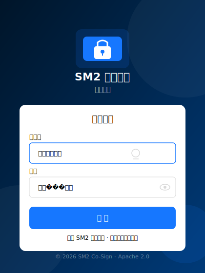
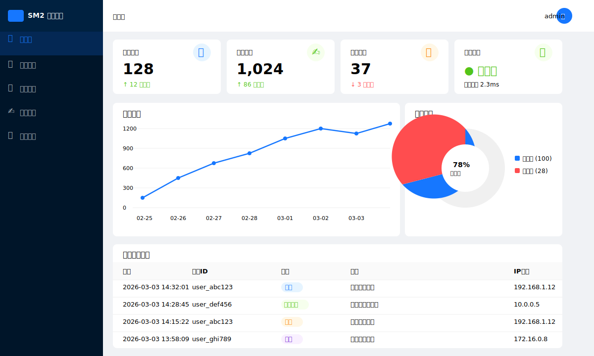
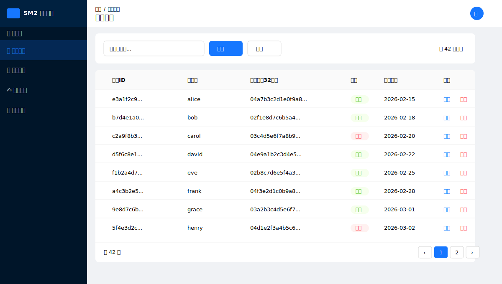
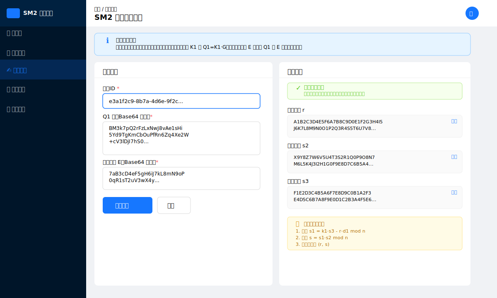

# SM2 协同签名项目

基于 SM2 国密算法的协同签名系统，采用客户端-服务端分离架构，实现密钥分片存储和协同签名/解密功能。

## 📦 项目结构

```
sm2-co-sign/
├── backend/          # 服务端 (Go) - Submodule
├── client/           # 客户端 (Rust) - Submodule  
├── frontend/         # Web 管理界面 (React)
├── docs/             # 技术文档
└── scripts/          # 测试脚本
```

## 🔗 子模块

| 模块 | 仓库 | 技术栈 | 描述 |
|------|------|--------|------|
| **backend** | [sm2-co-sign-server](https://github.com/kintaiW/sm2-co-sign-server) | Go 1.24 + Fiber v2 | 协同签名服务端，提供 REST API |
| **client** | [sm2-co-sign-client](https://github.com/kintaiW/sm2-co-sign-client) | Rust 2021 + libsm | 协同签名客户端，支持 FFI 接口 |

## 🖼️ 界面预览

### 登录页


### 仪表盘


### 用户管理


### 签名服务


## 🚀 快速开始

### Docker 部署（推荐）

```bash
# 克隆仓库
git clone --recursive https://github.com/kintaiW/sm2-co-sign.git
cd sm2-co-sign

# 一键启动
docker compose up -d

# 查看状态
docker compose ps

# 访问 Web 管理界面
# http://localhost
```

验证部署：

```bash
# 健康检查
curl http://localhost/mapi/health

# 查看统计信息
curl http://localhost/mapi/stats
```

### 获取 SDK 动态库

构建并提取客户端 SDK（Linux .so + .a + C 头文件）：

```bash
DOCKER_BUILDKIT=1 docker build \
  -f docker/Dockerfile.sdk \
  --target sdk-output \
  --output type=local,dest=./sdk \
  --ssh default .

# 产物:
#   sdk/lib/libsm2_co_sign_ffi.so    # Linux 动态库
#   sdk/lib/libsm2_co_sign_ffi.a     # Linux 静态库
#   sdk/include/sm2_co_sign_ffi.h    # C 头文件
```

### 手动部署

#### 克隆仓库（包含子模块）

```bash
git clone --recursive https://github.com/kintaiW/sm2-co-sign.git
# 或
git clone https://github.com/kintaiW/sm2-co-sign.git
cd sm2-co-sign
git submodule update --init --recursive
```

### 启动服务端

```bash
cd backend
go mod tidy
go run cmd/server/main.go
```

### 构建客户端

```bash
cd client
cargo build --release
```

### 启动前端

```bash
cd frontend
npm install
npm run dev
```

## 📡 API 接口

### 业务接口 (/api/*)

| 接口 | 方法 | 描述 |
|------|------|------|
| `/api/register` | POST | 用户注册（生成密钥对） |
| `/api/login` | POST | 用户登录（获取 Token） |
| `/api/sign` | POST | 协同签名 |
| `/api/decrypt` | POST | 协同解密 |

### 管理接口 (/mapi/*)

| 接口 | 方法 | 描述 |
|------|------|------|
| `/mapi/users` | GET | 获取用户列表 |
| `/mapi/keys` | GET | 获取密钥列表 |
| `/mapi/logs` | GET | 查询审计日志 |
| `/mapi/health` | GET | 健康检查 |

详细 API 文档请参考 [backend/docs/api.md](backend/docs/api.md)

## 🔐 安全架构

```
┌─────────────────────────────────────────────────────────┐
│                    SM2 协同签名架构                       │
├─────────────────────────────────────────────────────────┤
│  客户端 (D1)              服务端 (D2)                    │
│  ┌─────────┐              ┌─────────┐                   │
│  │  d1     │              │  d2     │                   │
│  │ (私钥分量)│              │ (私钥分量)│                   │
│  └────┬────┘              └────┬────┘                   │
│       │                        │                        │
│       ▼                        ▼                        │
│  ┌─────────┐              ┌─────────┐                   │
│  │ P1=d1*G │ ───────────▶ │ P2=d2⁻¹*G│                  │
│  └─────────┘              └─────────┘                   │
│       │                        │                        │
│       └────────┬───────────────┘                        │
│                ▼                                        │
│         ┌─────────────┐                                 │
│         │ Pa = d2⁻¹*P1 │                                │
│         │  + (n-1)*G  │                                 │
│         │  (协同公钥)  │                                 │
│         └─────────────┘                                 │
│                                                         │
│  完整私钥: d = d1 * d2 - 1 (不存储)                      │
└─────────────────────────────────────────────────────────┘
```

## 🐳 Docker 架构

```
┌─────────────────────────────────────────────────┐
│                Docker Container                  │
│                                                  │
│  ┌──────────────────────────────────────────┐   │
│  │  Nginx (:80)                              │   │
│  │  ┌─────────────────┐ ┌────────────────┐  │   │
│  │  │  /              │ │  /api/* /mapi/* │  │   │
│  │  │  静态文件 (React) │ │  反向代理       │  │   │
│  │  └─────────────────┘ └──────┬─────────┘  │   │
│  └─────────────────────────────┼────────────┘   │
│                                │                 │
│  ┌─────────────────────────────▼────────────┐   │
│  │  Go Backend (:9002)                       │   │
│  │  SM2 协同签名服务 + SQLite                 │   │
│  └──────────────────────────────────────────┘   │
│                                                  │
│  Volume: /app/data/ (SQLite 持久化)              │
└─────────────────────────────────────────────────┘
```

| 端口 | 服务 | 说明 |
|------|------|------|
| 80 | Nginx | Web 管理界面 + API 统一入口 |
| 9002 | Go Backend | 内部端口（可选暴露，调试用） |

## 📋 许可证

本项目采用 [Apache License 2.0](LICENSE) 许可证。

## 📚 文档

- [在线文档 (GitHub Pages)](https://kintaiW.github.io/sm2-co-sign/)
- [架构设计](docs/architecture.md)
- [API 参考](docs/api-reference.md)
- [项目计划](PROJECT_PLAN.md)

## 🔗 子模块文档

- [客户端文档 (GitHub Pages)](https://kintaiW.github.io/sm2-co-sign-client/)
- [服务端文档 (GitHub Pages)](https://kintaiW.github.io/sm2-co-sign-server/)
